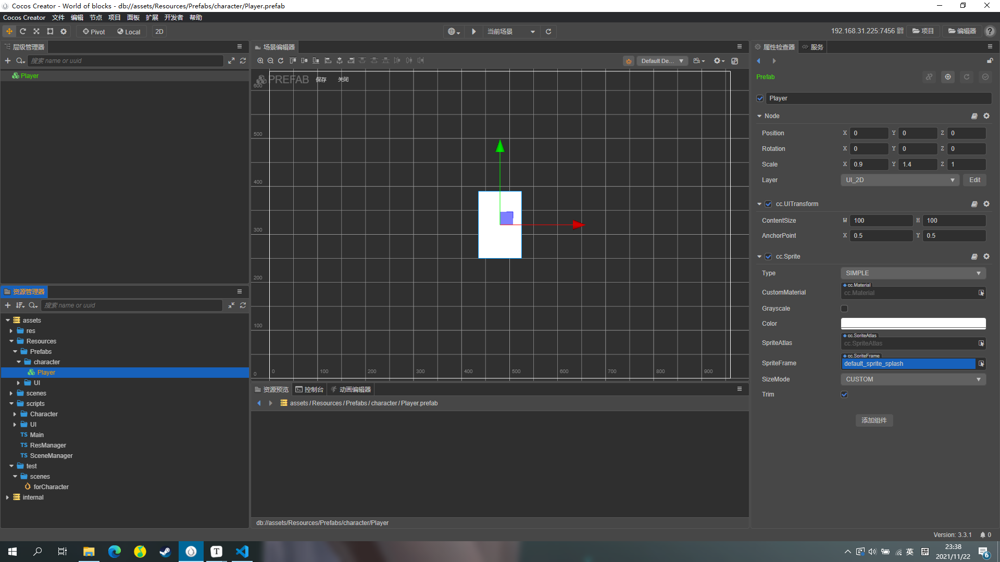

### 预制体

### 脚本类

一个角色由 **物理运动、动画、属性** 组成。

将不同的功能放到不同的类里，再通过 **桥梁设计模式** 将它们组合起来放到 **外观类** 里。

不同的功能类之间或许有交互，遵循一个原则：如果交互很深，则让它们直接交互，即互相组合；否则通过 **中介者** 来交互。

#### Controller

角色控制器，外观类，中介者类。

#### Motor

角色马达，负责角色的物理运动，**高度依赖** 角色物理状态类（PhysicStatus）。

#### PhysicStatus

角色物理状态，负责检测角色的物理状态。

#### Attr

角色属性类，负责角色的一些属性存储，例如跑步速度。

#### Animation

角色动画类，负责播放角色的动画。

#### Effect

角色特效类，负责播放角色的各种特效。

#### Audio

角色音效类，负责播放角色的各种音效。

### 缺一张类图

### 具体接口

#### Controller

##### - move(dir)

##### - jump()

##### - dash()

#### Motor

##### - isDashing

##### - moveSpeedScale

##### - move(dir)

##### - oneJump()

##### - doubleJump()

##### - dash()

#### PhysicStatus

##### - isOnGround

#### Attr

##### - moveSpeed

##### - toMaxSpeedDuration

##### - toStopDuration

##### - oneJumpForce

##### - oneJumpHeldForce

##### - doubleJumpForce

##### - doubleJumpHeldForce

##### - graceTime

##### - saveOperationDuration_ForJump

##### - saveOperationDuration_ForDash

#### Animation

##### - playIdle()

##### - playMove(speedScale)

##### - playOneJumpStart()

##### - playOneJumpLeaveGround()

##### - playDoubleJumpStart()

##### - playFall()

##### - playFallToGround()

##### - playDashStart()

##### - playDashing()

##### - playDashFinish()

##### - playDied()

#### Effect0

##### - playMove()

##### - playOneJump()

##### - playDoubleJump()

##### - playDashStart()

##### - playDashing()

##### - playDashFinish()

##### - playDied()

#### Audio

##### - playMove()

##### - playOneJump()

##### - playDoubleJump()

##### - playFall()

##### - playFallToGround()

##### - playDashStart()

##### - playDashing()

##### - playDashFinish()

##### - playDied()