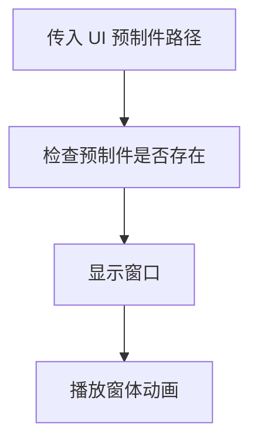
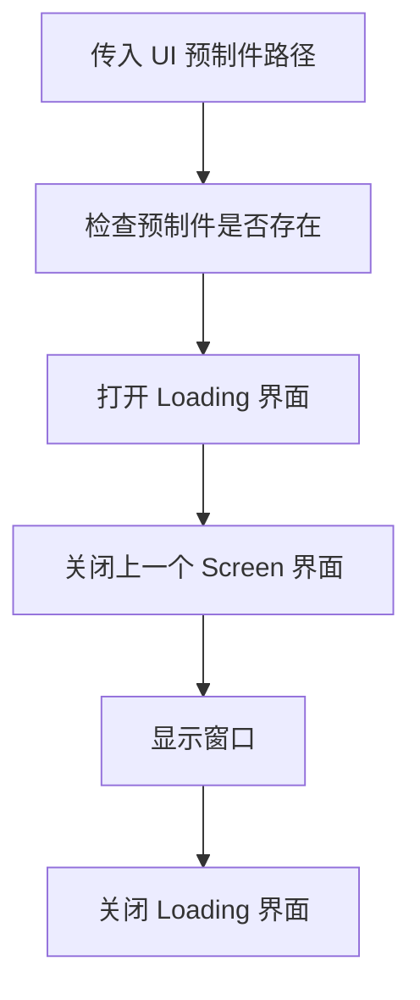
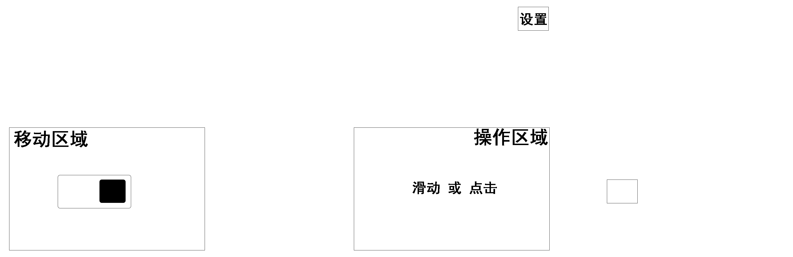

### 需求

- 支持 UI 类型：**Screen 、Fixed 、PopUp 、Tips**

  > Screen ：代表铺满屏幕，一般用作背景的 UI，这种 UI 一般没有动画，例如游戏的主菜单界面。
  >
  > Fixed ：代表存在于多个场景中，并且需要显示在上层的 UI，例如浏览器的「返回上个界面」、「刷新」...
  >
  > PopUp ：代表弹出窗体，这种 UI 一般需要 开启/关闭 动画，例如「Edge」浏览器的侧边导航窗口。
  >
  > Tips ：代表提示窗体，这种 UI 一般也需要动画，但是它是独立的，跟其他窗体没什么关系，例如「掉线提示」窗体。

- 除了 打开 / 关闭 窗口，不同类型还有一些特殊的处理方法。

  > Screen 类型：打开下一个之前要关闭上一个，而且不能关闭当前打开的。
  >
  > Fixed 类型：
  >
  > PopUp 类型：每次新打开的窗口都要在最前面。
  >
  > Tips 类型：有多个提示时，需要对提示窗口进行排列避免遮挡，如果数量过多还要限制显示数量；提示窗口打开一段时间需要自动关闭

- 统一管理和释放资源。

  > 这里泛指 UI 窗体依赖的图片资源。

- 采用「 MVC 」模式。

- 支持不同的 UI 层级。

  > Cocos Creator 中的渲染层级由节点树中节点的顺序，从上向下渲染，所以需要自己做好层级管理。

- 支持等待栈。

  > 有时可能会同时出现多个窗口，这时候应该有秩序的一个一个显示，主要发生于「 Tips 」类型窗口。

### 流程

#### UIManager

Manager 管理所有的 UI 窗体，并且对外提供接口：打开 UI 、关闭 UI ...

Manager 定义好流程，各个 UI 窗体实现流程中的具体步骤，例如播放什么动画 ...

Manager 初始化时创建好节点来进行层级分类 ...

#### UIManager扩展

> 对于不同类型窗口需要的特殊处理，UIManager 对外开放扩展

- **Screen 扩展**

### 类结构

